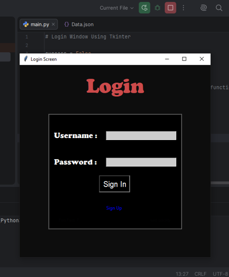
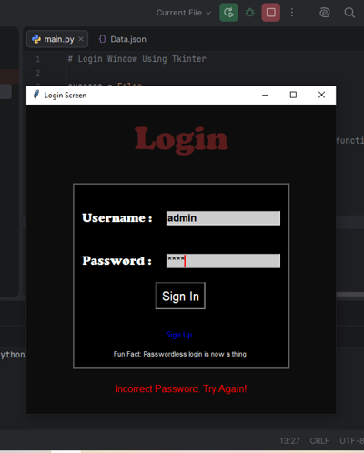
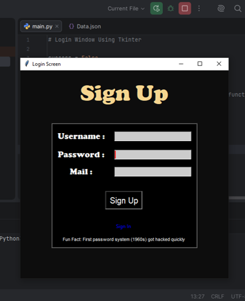
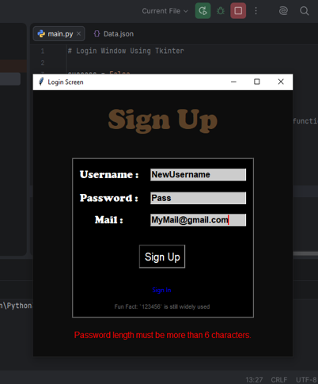
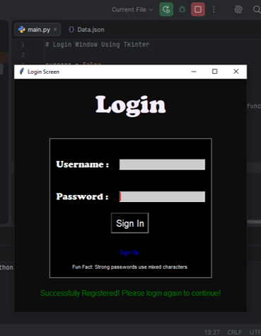
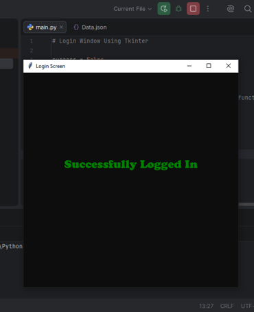

# Animated Login System Using `tkinter`
---

## Features
- SignIn System
- SignUp System
- Username & Password Authentication
- JSON Data Storage
- GUI Built with Tkinter
- Animations

---

## Modules Used
- pandas
- tkinter
- json
- time
- datetime
- threading

---

## Screenshots
### Login Screen

### When Authentication gets Failed
 
### SignUp Screen
 
### Password Making
 
### Regestration Success
 
### Login Success
 
---
